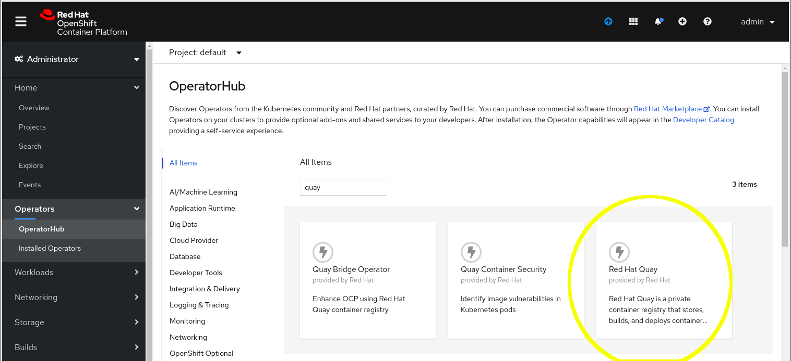
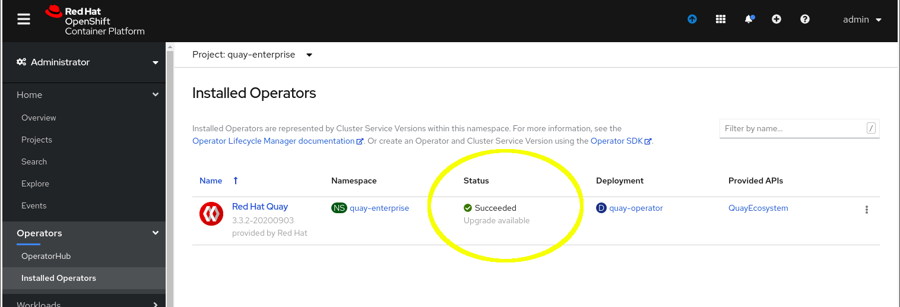

# Ansible Operator Lab Configuration

## Golang Installation
To install Go, run the following as the root user:

```bash
# yum install -y golang.x86_64
```

## Install OpenShift and Container Image Commands:
* oc
* podman, buildah
* curl
* ansible
* make

## OpenShift Variables
Ensure that users configure environment variables for login to OpenShift:
```bash
$ oc login api.$OCP_CLUSTER.$OCP_DOMAIN:6443
```

## Installing Quay
Configure environment variables:
```bash
$ QUAY_NAMESPACE="quay-enterprise"
$ QUAY_NAME="registry"
```
Create a project named `quay-enterprise`:
```bash
$ oc new-project ${QUAY_NAMESPACE}
```
Log in to quay.io using the Red Hat provided password and create a secret:
```bash
$ podman login -u="redhat+quay" -p="<REDACTED>" quay.io
$ oc create secret generic redhat-pull-secret --from-file=".dockerconfigjson=${XDG_RUNTIME_DIR}/containers/auth.json" --type='kubernetes.io/dockerconfigjson'
```
Install the Quay operator via the Web UI to the project named `quay-enterprise`.

Wait for `Status` state `Succeeded`:


Create the Quay instance by running the following:

```bash
$ CLUSTER_DOMAIN=$(oc get route -n openshift-authentication oauth-openshift -o=jsonpath='{.spec.host}' | sed "s/oauth-openshift\.//")
$ oc create -f - <<EOF
apiVersion: redhatcop.redhat.io/v1alpha1
kind: QuayEcosystem
metadata:
  name: ${QUAY_NAME}
  namespace: ${QUAY_NAMESPACE}
spec:
  quay:
    imagePullSecretName: redhat-pull-secret
    externalAccess:
      hostname: ${QUAY_NAME}-${QUAY_NAMESPACE}.${CLUSTER_DOMAIN}
EOF
```
Obtain the name of the registry that will be used during the workshop:
```bash
$ REGISTRY=$(echo ${QUAY_NAME}-${QUAY_NAMESPACE}.${CLUSTER_DOMAIN})
$ echo ${REGISTRY}
```

### Setting the Registry as Trusted
Check that all nodes are in a `Ready` state:
```bash
$ oc get nodes
```
Add the registry as trusted:
```bash
$ oc patch --type=merge --patch="{\"spec\":{\"registrySources\":{\"insecureRegistries\":[\"${REGISTRY}\"]}}}" image.config.openshift.io/cluster
```
The machine-config-operator will push this change to all nodes. As the change is pushed out, nodes will change status to `NotReady,SchedulingDisabled`. Wait for all nodes to be `Ready`.

The default login for quay is quay/password.
### CRC - Setting the Registry as Trusted
```bash
 ssh -i ~/.crc/machines/crc/id_rsa -o StrictHostKeyChecking=no core@$(crc ip) << EOF
  sudo echo " " | sudo tee -a /etc/containers/registries.conf
  sudo echo "[[registry]]" | sudo tee -a /etc/containers/registries.conf
  sudo echo "  location = \"${REGISTRY}\"" | sudo tee -a /etc/containers/registries.conf
  sudo echo "  insecure = true" | sudo tee -a /etc/containers/registries.conf
  sudo echo "  prefix = \"\"" | sudo tee -a /etc/containers/registries.conf
  sudo systemctl restart crio
  sudo systemctl restart kubelet
EOF
```

## Downloading Red Hat Images
Log in to the registry and create accounts for course users(1-n), "ubi8" and "openshift3".

Use the step below for the registry that will be used for the workshop.
### Log in to the Red Hat Registry
```bash
$ podman login registry.redhat.io
```
### Download Red Hat Images to Local Registry
Access to a number of images used in this course requires a Red Hat account. Download them to the local OpenShift registry as follows:
```bash
$ oc login -u kubeadmin
$ REGISTRY="$(oc get route/default-route -n openshift-image-registry -o=jsonpath='{.spec.host}')"
$ oc new-project openshift3
$ skopeo copy docker://registry.redhat.io/openshift3/ose-ansible docker://${REGISTRY}/openshift3/ose-ansible
$ oc new-project ubi8
$ skopeo copy docker://registry.redhat.io/ubi8/go-toolset docker://${REGISTRY}/ubi8/go-toolset
```

The image quay.io/operator-framework/ansible-operator is downloaded in Exercise-4. This image appears to download:
* https://galaxy.ansible.com/download/community-kubernetes-0.11.1.tar.gz
* https://galaxy.ansible.com/download/operator_sdk-util-0.1.0.tar.gz

### Download Red Hat Images to an External Registry
#### Create Users in the External Registry
Create users:
- user[1-n] for workshop attendies
- openshift3
- ubi8

#### Download Images
Access to a number of images used in this course requires a Red Hat account. Download them to the local OpenShift registry as follows:
```bash
$ REGISTRY="<route to registry in use>"
$ podman login -u openshift3 -p openshift3 ${REGISTRY}
$ skopeo copy docker://registry.redhat.io/openshift3/ose-ansible docker://${REGISTRY}/openshift3/ose-ansible
$ podman login -u ubi8 -p ubi8ubi8 ${REGISTRY}
$ skopeo copy docker://registry.redhat.io/ubi8/go-toolset docker://${REGISTRY}/ubi8/go-toolset
```
Manually set the `Repository Visibility` to `public`.

<!--
The image quay.io/operator-framework/ansible-operator is downloaded in Exercise-4. This image appears to download:
* https://galaxy.ansible.com/download/community-kubernetes-0.11.1.tar.gz
* https://galaxy.ansible.com/download/operator_sdk-util-0.1.0.tar.gz
-->

Optional Images:
* quay.io/operator-framework/ansible-operator:v1.3.0

## Download the Operator SDK
```bash
$ export RELEASE_VERSION=v1.2.0
$ cd /usr/share/workshop/
$ curl -LO https://github.com/operator-framework/operator-sdk/releases/download/${RELEASE_VERSION}/operator-sdk-${RELEASE_VERSION}-x86_64-linux-gnu
```

## OpenShift Accounts
Create accounts for:
* ${USER}
* ${USER}-client

## OpenShift Projects
Create OpenShift projects owned by ${USER}:
* project-${USER}

## OpenShift Roles
For each user:
oc policy add-role-to-user registry-editor <username>

## Podman rootless configuration
/etc/subuid may need to be configured for podman rootless use.